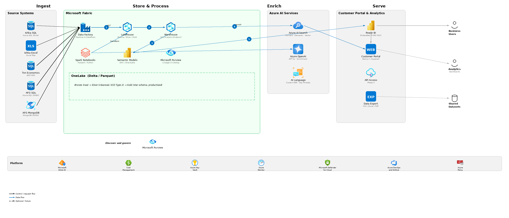

# Claude Code Skills

A collection of custom skills for [Claude Code](https://docs.anthropic.com/en/docs/claude-code) that extend Claude's capabilities with domain-specific expertise.

## Skills

### Azure Architecture Diagram

Generate professional Azure architecture diagrams matching the [Microsoft Azure Architecture Center](https://learn.microsoft.com/en-us/azure/architecture/browse/) visual style. Produces high-resolution PNG diagrams with official Azure icons, zone groupings, numbered data flows, and platform bars.

**Features:**
- Official Microsoft Azure SVG icons (683 services) with automatic fallback
- Zone groupings (grey, green scope boundaries, dashed)
- Numbered step connectors with labels
- Platform bar for cross-cutting services
- Pipeline, hub-and-spoke, layered, and zone-based layout patterns

**Example output:**



[View skill &rarr;](azure-architecture-diagram/)

### Executive CV

Create professional, ATS-friendly executive CVs for C-suite and senior leadership roles (CTO, CEO, COO, CFO, CIO, Director, NED) following UK best practice. Outputs a formatted .docx file.

**Features:**
- UK executive CV conventions (2-page, no photo, reverse chronological)
- Achievement bullet formula: Action + Scope + Quantified Outcome
- Optional EVR (Environment-Vision-Resources) narrative framework
- Role-specific guidance for CTO, CEO, COO, CFO
- Discovery questions to extract strategic impact from candidates

[View skill &rarr;](executive-cv/)

## Installation

### Claude Code (CLI)

Add a skill to your project:

```bash
claude skill add /path/to/skills/azure-architecture-diagram
```

Or add as a user-level skill available across all projects:

```bash
claude skill add --user /path/to/skills/azure-architecture-diagram
```

### Claude Desktop / Cowork

Copy the contents of the skill's `SKILL.md` into your project instructions, or reference the file path directly.

## Requirements

### Azure Architecture Diagram
- Python 3.8+
- [Pillow](https://pillow.readthedocs.io/) (`pip install Pillow`)
- `librsvg2-bin` for SVG to PNG conversion (auto-installed by setup script on Linux)
- Internet access for first-time icon download from Microsoft CDN

### Executive CV
- Access to the `docx` skill (built-in on Claude Code)

## Licence

[MIT](LICENSE)
